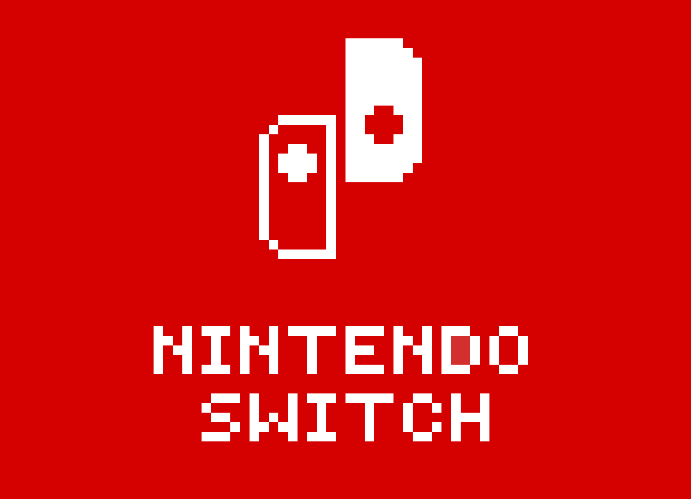

# Nintendo Case Study Analysis

## Data Visualisation
[Nintendo vs. Steam Tableau](https://public.tableau.com/app/profile/data.monkey5133/viz/NintendovsSteamregularseasondiscounts/Nintendo)

## Objective

The objective of this project is to analyse the games on discount within the Nintendo eShop, with the aim of deriving actionable insights and recommendations to enhance its efficacy and user experience.

## Recommendation

- Regular sales: Most games at 30-40% off, with an average discount around 50%.
- Seasonal sales: Ramp up discounts to 80-90% on a wide selection of games.
- Limit regular sale discounts to 100 games, then expanding to 1000 during seasonal events.
- Sort catalogue by popularity for easier browsing.
- Refresh the catalogue monthly to keep offerings exciting.
- Introduce a game rating system for informed choices.
- Feature one heavily discounted game on the first page of the catalogue to draw attention.
- Surprise customers with occasional free game offers.
- Consider discounting Nintendo's own games to broaden appeal.      