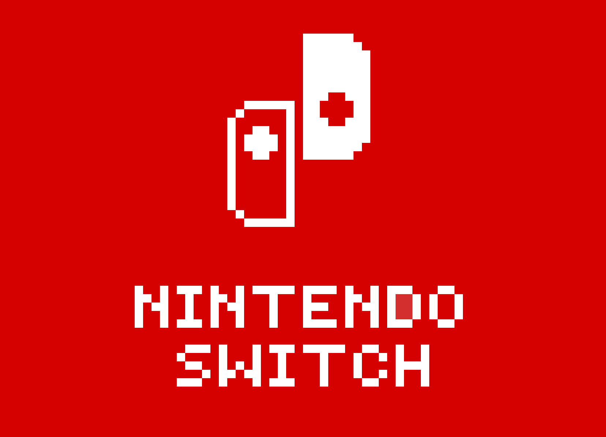
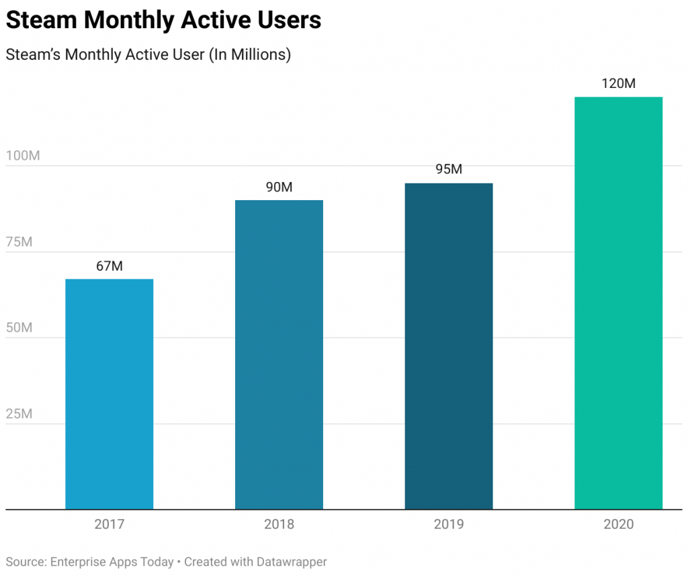
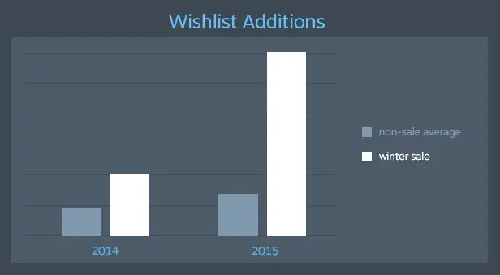
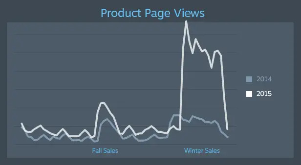

`r source("nintendo_analysis.R")`

<style>

  body {
    font-size: 20px;
  }
  
  h1{
    color: #32CD32; /* Lime Green */
  }
  
  h2{
    color: #1E90FF; /* Dodger Blue */
  }
  
  h3{
    color: #FF8C00; /* Dark Orange */
  }

  .finding {
    color: #DA70D6; /* Orchid */
  }
  .solution {
    color: #DC143C; /* Crimson */
  }
  .info {
    color: #FFD700; /* Gold */
  }

</style>
<br>

## Objective

The objective of this project is to <span class="info"> analyse the games on discount within the Nintendo eShop </span>, with the aim of deriving actionable insights and recommendations to enhance its efficacy and user experience.   
<br>

## Recommendation

- Regular sales: Most games at 30-40% off, with an average discount around 50%.
- Seasonal sales: Ramp up discounts to 80-90% on a wide selection of games.
- Limit regular sale discounts to 100 games, then expanding to 1000 during seasonal events.
- Sort catalogue by popularity for easier browsing.
- Refresh the catalogue monthly to keep offerings exciting.
- Introduce a game rating system for informed choices.
- Feature one heavily discounted game on the first page of the catalogue to draw attention.
- Surprise customers with occasional free game offers.
- Consider discounting Nintendo's own games to broaden appeal.      
<br>

## Introduction   
<br>

### Nintendo

<center>

</center>

Nintendo, a pioneer in the gaming industry, has captivated audiences worldwide with its innovative consoles and beloved franchises for decades. From the iconic characters like Mario and Link to groundbreaking consoles like the Nintendo Entertainment System (NES) and the Nintendo Switch, Nintendo has continually pushed the boundaries of gaming, delivering memorable experiences that resonate with players of all ages.    
<br>

Fast facts about Nintendo Switch ([source](https://nerdbear.com/nintendo-statistics/)):

- The Switch is currently behind 85% of Nintendo’s yearly revenue.  
- In 2020, the Nintendo Switch soared ahead with a remarkable 28.3 million units sold, outstripping both the PS5's 4.39 million units and the Xbox Series X/S's 3.03 million units.    
<br>

With a rich history of creativity and innovation, Nintendo remains a cornerstone of gaming culture, inspiring generations of gamers and continuing to shape the future of interactive entertainment.    
<br>

### Nintendo eShop

The Nintendo eShop serves as the digital storefront for Nintendo's gaming platforms, offering a diverse array of downloadable content ranging from games to additional features and add-ons, all available for direct online purchase.   
<br>

<center>

</center>

The [Nintendo's current offers page](https://store.nintendo.com.au/au/nintendo-eshop/current-offers) stands as a valuable resource for discerning gamers seeking advantageous deals and discounted rates across a diverse spectrum of titles.    
<br>

The eShop is increasingly important for Nintendo; as of 2023, <span class = "info"> **48.2% of the games sold were digital** </span>, marking a growth of 5.6 basis points since 2022 ([source](https://www.gameshub.com/news/news/nintendo-financial-report-fy-2023-digital-sales-consoles-2615762/)). This trend highlights a broader industry movement towards digital consumption, driven by the convenience and growth of online gaming platforms. <span class = "info"> **By improving the quality of the current offerings on the eShop, Nintendo can potentially attract new users and increase company profits.** </span> Ensuring a high-quality digital marketplace is essential to meet consumer expectations and capitalise on this growing digital preference.   
<br>

### Steam   

<center>

</center>

In 1977, Nintendo revolutionised the gaming industry with the introduction of their first gaming console, the Colour TV-Game 6. Fast forward 26 years later, the landscape shifted once again with the launch of Steam, an innovative gaming platform that would reshape how gamers interact with their favourite titles.    
<br>

Fast facts about Steam's impact on the gaming industry ([source](https://www.enterpriseappstoday.com/stats/steam-statistics.html)):    


- With over **50,000 games** available on the US Steam platform as of 2022, Steam has become the go-to destination for gamers seeking an extensive library of titles.
- Steam dominates the PC gaming market, accounting for **50% to 70% of all PC game downloads worldwide**, solidifying its position as the premier distribution platform for digital games.
- Boasting a staggering **75% share of the global gaming distribution market, Steam attracts an impressive 20 million gamers daily**, highlighting its unparalleled reach and influence.
- In 2020, Steam welcomed an average of **2.6 million new purchasers each month**, underscoring its sustained growth and enduring appeal among gamers worldwide.   
<br>

The recent release of <span class = "info"> **Steam's handheld gaming console marks a pivotal moment in the industry, signalling a formidable challenge to traditional gaming giants like Nintendo** </span>. With its vast library of games and widespread adoption, Steam's foray into handheld gaming poses an unprecedented threat, promising to reshape the gaming landscape yet again.    
<br>

## Collecting Data

[Demo Video](https://vimeo.com/953614329?share=copy) The data presented here has been collected using web scraping softwares I developed. <span class = "info"> The data colected on "04-06-2024" is  assumed to represent how Nintendo and Steam offer game discounts during regular seasons. </span>    
<br>

### Web scraping results    

<br>
<table class="table table-hover">
  <thead>
    <tr>
      <th scope="col">Type</th>
      <th scope="col">Total games</th>
      <th scope="col">Metacritics infos</th>
      <th scope="col">Overall success rate</th>
    </tr>
  </thead>
  <tbody>
    <tr>
      <td>Nintendo</td>
      <td>1000</td>
      <td>863</td>
      <td>86.30%</td>
    </tr>
    <tr>
      <td>SteamSpy</td>
      <td>200</td>
      <td>196</td>
      <td>98.00%</td>
    </tr>
  </tbody>
</table>
<br>

    
<br>

### Web Scraping Process
I started by scraping for the current discounts directly from [Nintendo's current offers page](https://store.nintendo.com.au/au/nintendo-eshop/current-offers) to obtain Nintendo's discounted games. On the other hand, scraping data from [Steam's current offers page](https://steamdb.info/sales/) proved challenging and impractical due to the implementation of a CAPTCHA system to block bots on their website.   
<br>

To circumvent this, I adopted an alternative approach. I relied on information provided by [SteamSpy](https://steamspy.com/deal/), a third-party website that scrapes Steam discount data daily. The results from SteamSpy do match those on Steam. However, SteamSpy only offers data for 200 discounted games at a time, despite not coverign the entirety of discounted games on the platform,  the dataset should still provide a comprehensive comparison of the discounting strategies between these two leading gaming companies.    
<br>

Thereafter, involved mimicking unique [Metacritic's game ratings](https://www.metacritic.com/game/pac-man-99/) by identifying its URL pattern to retrieve information about the discounted games. Finally, I then exported the gathered data into a CSV file, which would be ready for further data cleaning and analysis in R.    
<br>

## Data Cleaning

```{r}
glimpse(df_nin)
glimpse(df_nin_cleaned)
```

1. **Exclusion of Games Without Ratings:** Games lacking ratings on Metacritic were omitted from the analysis to maintain data reliability.
2. **Standardisation of Column Data Types:** Conversion of column data types was performed to ensure seamless calculations and sorting procedures.
3. **Currency Standardisation to $AUD**: All prices were converted to Australian Dollars using the closing exchange rate of USD/AUD on the date of data collection (e.g., for data collected on 04-06-2024, the USD/AUD exchange rate was $1.5046).
4. **Removal of Critics Columns:** Given the substantial discrepancy between user and critic reviews, columns pertaining to critic reviews were eliminated from the datasets to streamline analysis.
5. **Column Renaming:**
   - `user_score` was renamed to `rating`.
   - `user_reviews` was renamed to `popularity`.    
<br>

## Column Definitions

- <span class = "info"> **title** </span>: The name of the game.
- <span class = "info"> **original_price** </span>: The game's price before any discounts.
- <span class = "info"> **special_price** </span>: The game's current discounted price at the time of data collection.
- <span class = "info"> **discount_per** </span>: Percentage discount applied, calculated as `(original_price - special_price) / original_price`. 
- <span class = "info"> **rating** </span>: User rating of the game on Metacritic. 
- <span class = "info"> **popularity**  </span>: Total amount of user reviews for the game on Metacritic.    
<br>

## Analysis

Nintendo and Steam hold significant sway in the video gaming sector, operating as prominent oligopolies within the industry. Given their substantial market presence, they wield considerable influence over consumer choices and industry trends.    
<br>

Consequently, <span class = "info"> **it is crucial for Nintendo to carefully monitor Steam's pricing strategies** </span>. By monitoring each other's pricing strategy allows both Nintendo and Steam to optimise their own pricing models, thereby maximising profits and maintaining a competitive edge.   
<br>

```{r}
summary(df_nin_cleaned)
summary(df_steam_cleaned)
```
<br>  

```{r}
# Nintendo's Standard Deviations
sapply(df_nin_cleaned[, c("original_price", "special_price", "discount_per", "popularity")], sd)

# Steam's Standard Deviations
sapply(df_steam_cleaned[, c("original_price", "special_price", "discount_per", "popularity")], sd)
```
<br>

### Original and Special Price

<center>
```{r}
og_price_plot
sp_price_plot
```
</center>

Steam exhibits greater variability in both original and special prices, indicative of a wider array of pricing tactics or a more diverse product range. Conversely, Nintendo demonstrates a more uniform pricing approach, with less variability observed. <span class="finding"> This suggests more consistent pricing strategy by Nintendo, whereas Steam's pricing model appears more dynamic </span>.   
<br>

<center>
```{r}
og_sp_price_plot
discount_abs_plot
```
</center>

```{r}
cat("Mean absolute dollar discount for Nintendo: $", mean_discount_abs_nin, "\n")
cat("Mean absolute dollar discount for Steam: $", mean_discount_abs_steam, "\n")
cat("The p-value for the hypothesis test comparing discount absolute difference significane between Nintendo and Steam is:", p_value_discount_abs, "\n")
if (p_value_discount_abs < 0.05) {
  cat("The difference in the absolute dollar discount between Nintendo and Steam is statistically significant.\n")
} else {
  cat("The difference in the absolute dollar discount between Nintendo and Steam is not statistically significant.\n")
}
```

For games originally priced between $50 and $100, Nintendo tends to offer discounts better than half price, while Steam usually offers less. However, the difference in absolute dollar discount is still statistically insignificant. <span class="finding"> This suggests that Nintendo may be prioritising discounts on their initially lower-priced games. This strategy is effective because the potential loss from discounting is minimal, yet it enhances the attractiveness of their discounted catalog with significant percentage reductions. </span> **To make Nintendo's discount catalouge even more attractive, I would advise Nintendo to <span class="solution"> feature a select few games with substantial dollar discounts prominently on the first page of their discount catalogue. </span> These games don't necessarily need to be popular; the key is their significant absolute dollar discount, which can grab customers' attention. This approach can create the perception that Nintendo offers deeper discounts in terms of absolute value compared to platforms like Steam.**       
<br>

### Percentage Discount

<center>
```{r warning=FALSE}
nin_discount_per_plot
steam_discount_per_plot
```
</center>

```{r}
cat("Mean percentage discount for Nintendo: ", mean_discount_per_nin, "%\n")
cat("Mean percentage discount for Steam: ", mean_discount_per_steam, "%\n")

t_test_discount_per <- t.test(df_nin_cleaned$discount_per, df_steam_cleaned$discount_per)
p_value_discount_per <- t_test_discount_per$p.value
cat("The p-value for the hypothesis test comparing discount percentages significane between Nintendo and Steam is:", p_value_discount_per, "\n")
if (p_value_discount_per < 0.05) {
  cat("The difference in discount percentage between Nintendo and Steam is statistically significant.\n")
} else {
  cat("The difference in discount absolute between Nintendo and Steam is not statistically significant.\n")
}
```

Nintendo offers significantly more discount percentage than Steam. The null hypothesis is rejected at the 5% significance level, suggesting strong evidence that Nintendo offers statistically more percentage discount than Steam. This may be a surprising finding to many gamers, <span class="finding"> Steam gives consumers the impression that they're more generous in discounting their game's than Nintendo, when in fact it is not for most cases. </span>    
<br>

I would recommend Nintendo to align more closely with Steam's discounting model. This could involve <span class="solution"> **reducing most of their games to between 30% and 40% during regular sales </span>, with an <span class="solution"> average discount mean controlled at approximately 50%**. </span> Conversely, Nintendo could then <span class="solution"> **create seasonal sales by increasing the discounts to the current distribution, with most games discounted at 80% to 90%, yielding an overall mean discount of around 70%** </span>.    
<br>

The introduction of seasonal sales could serve as an impactful marketing initiative for Nintendo, enhancing brand visibility and attracting new consumers. This strategic adjustment in discounting not only has the potential to shape consumer perceptions of value but also <span class="info"> **positions Nintendo more competitively within the gaming market landscape, without offering more discounts than they currently do** </span>.    
<br>

### Rating

<center>
```{r warning=FALSE}
rating_plot
```
</center>

The ratings of discounted games on Nintendo and Steam exhibit similarities in both distribution and overall values. This indicates a <span class="finding"> **comparable quality of games offered at discounted prices on both platforms**. </span>   
<br>

### Popularity

<center>
```{r}
popularity_plot
```
</center>

Most games on both Nintendo and Steam have minimal popularity. However, <span class="finding"> **Steam features notably more popular games on discount compared to Nintendo**. </span> This contributes to Steam's reputation for offering more attractive discounts than Nintendo. Hence, <span class="solution"> **Nintendo may need to consider discounting some of their popular self-developed games to compete with Steam**</span>.   
<br>

### Genre

<center>
```{r}
nin_top_genre
steam_top_genre
```
</center>

<span class="finding"> **Both Nintendo and Steam effectively target their respective audiences with their discount strategies**. </span> Nintendo, known for its family-oriented focus, discounts more  on genres like 2D Platformer, Puzzle, and Party games. In contrast, Steam, which caters to a more mature audience, frequently offers discounts on genres such as Survival, FPS, and Sandbox games.       
<br>    

### Publisher

<center>
```{r}
nin_top_pub
steam_top_pub
```
</center>

Analysis of the top genres and publishers shows that <span class="finding"> Steam and Nintendo rarely discount the same games simultaneously. </span> <span class="info">This differentiation in discounting items benefits both companies by reducing direct competition in their oligopolistic market. </span>   
<br>

### Nintendo's Discounting Model

```{r}
cat("Number of records in Nintendo model:", nrow(df_nin_cleaned), "\n")
summary(nin_model)
```

- Approximately 10.27% of the variability in discount percentage can be explained by the independent variables rating, popularity, and release date. Though the R-squared value is modest, the model's overall significance is supported by a significant F-statistic at the 95% confidence level.
- **Rating**: For every one-unit increase in the rating, the discount percentage is expected to decrease by approximately 1.812 units.
- **Popularity**: While there's a slight negative trend, the effect of popularity on discount percentage lacks statistical significance at the 95% confidence level.
- **Release Date**: For every one-unit increase in the release date, the discount percentage is expected to decrease by approximately 0.0055 units.   
<br>

### Steam's Discounting Model

```{r}
cat("Number of records in Steam model:", nrow(df_steam_cleaned), "\n")
summary(steam_model)
```

- About 34.97% of the variability in discount percentage can be explained by the independent variables rating, popularity, and release date. Despite a modest R-squared value, the model overall is statistically significant with F-statistic below 95% confidence level.
- **Rating Significance**:  For every one-unit increase in the rating, the discount percentage is expected to decrease by approximately 4.07 units.
- **Popularity Effect**: A slight positive effect on discount percentage with increasing popularity is observed, but it's not statistically significant at a 95% confidence level.
- **Release Date Impact**: For every one-unit increase in the release date, the discount percentage is expected to decrease by approximately 0.0221 units.    
<br>

### Discounting Model Summary

In summary, both <span class="info"> Nintendo and Steam employ similar discounting strategies in nature. </span> Higher game ratings are correlated with less discounting, while the impact of popularity on discount prices remains uncertain. Meanwhile, newer games tend to receive lesser discounts. The statistical findings above coincides with common industry beliefs. However, Steam's model demonstrates a notably higher R-squared value and more substantial effects of game rating and release date. <span class="finding"> **Suggesting that Steam has a more refined discounting pricing model compared to Nintendo**. </span>   
<br>

## Website Layout & Marketing Recommendation

### Order by popularity


I advice that <span class="solution"> **Nintendo reorganises its current offers based on game popularity** </span>, as their current method lacks sorting or filtering options, resulting in a cluttered layout on their website.        
<br>

Nintendo's brand ethos revolves around delivering family-friendly content and fostering a gaming environment that appeals to players of all ages. However, <span class="finding"> explicit and niche genres frequently appear in the top pages or even the first page of the discount catalogue. </span> To address this, <span class="solution"> **quantifying game popularity through external sources such as Metacritic's user reviews or utilising Nintendo's internal sales data, listed in descending order** </span>, particularly on the first page, could significantly enhance user engagement with the discount page, by letting customer's view games that they're more familiar with.   
<br>

### Rating system


I would also suggest that <span class="solution"> **Nintendo incorporate game ratings into their current offers page**. </span> Personally, whenever I stumble upon a game that catches my interest on the eShop, my initial step is to visit [Metacritic](https://www.metacritic.com/game/the-legend-of-zelda-breath-of-the-wild/) to review both the critic and user ratings. However, after repeating this process for multiple games, it becomes cumbersome, leading me to eventually stop browsing the eShop altogether.   
<br>

While displaying game ratings may result in lower sales for poorly rated games, it can <span class="info"> **significantly boost the discovery and willingness to purchase highly rated ones**. </span> Overall, integrating game ratings has the potential to enhance user experiences and consequently increase overall sales on the platform.    
<br>

### Reduce total games on discount
As of June 4th, 2024, [Moby Games](https://www.mobygames.com/platform/switch/) reports that there are a staggering 11,031 games available on the Nintendo Switch platform, which represents approximately 9% of their total game library.    
<br>

Given the overwhelming number of discounted titles, <span class="solution"> navigating through all 1,000 can be daunting for users. </span> To streamline the browsing experience and ensure better visibility for discounted games, I recommend that <span class="solution"> **Nintendo reduces the number of games on discount at any given time to a more manageable 100 titles**. </span> This adjustment would <span class="info"> **not only facilitate easier exploration for users but also decreases the potential discount-loss** </span>. Additionally, it'll be <span class="info"> easier for Nintendo to select the demographics and control the discount games. </span>    
<br>    

### Refresh entire catalogue periodically
<span class="finding"> Nintendo's approach to discount game sales lacks clarity, leaving users uncertain about when to expect discounts. </span> Personally, whenever I visit the eShop, I often encounter a frustrating situation: either finding many games still on discount from previous visits or hearing from friends that I've missed out on game sales I was interested in. Sometimes, it's both scenarios simultaneously, compounding the frustration.    
<br>

To enhance this experience, <span class="solution"> **Nintendo could refresh the entire selection on a monthly basis**. </span> Additionally, implementing proactive communication, such as <span class="solution"> sending out email notifications about the updated discount catalogue on a regular basis, </span> would greatly benefit users like me, ensuring we stay informed and engaged with their offerings.   
<br>

### Free game


Steam's strategy of offering free games is a good marketing move that keeps users engaged and coming back regularly to check out their discounted offerings. Inspired by this approach, I would suggest that Nintendo consider incorporating a similar tactic by <span class="solution"> **irregularly placing one free game within the top 10 pages of their website**. </span> This not only <span class="info"> incentivises users to frequent their catalog but also encourages them to explore the discounted titles available. </span> By enticing users with complimentary content, Nintendo can enhance user engagement and drive traffic to their platform while also promoting their discounted games effectively.   
<br>

### Seasonal sales

<center>

</center>

Steam's marketing strategy, featuring seasonal special game deals during events like Winter and Summer sales has proven to be remarkably effective in drawing new users, particularly students, to their platform.   
<br>

<center>


</center>

The increase in interest during seasonal sales is substantial compared to regular seasons ([source](https://www.gamesindustry.biz/new-approach-from-valve-pays-dividends-in-winter-sale)).    
<br>

To leverage this success, I suggest Nintendo <span class="solution"> **reintroduce discounted pricing for a broader range of titles, encompassing at least 1,000 games, while also elevating the overall discount percentage.** </span> This strategic move not only attracts fresh users but also deepens engagement and cultivates loyalty among current patrons, likely propelling the platform towards even greater success.   
<br>

Steam's season sales includes:    
<br>

1. Deep Discounts    

Regular season sales often feature discounts ranging from 30% to 40%, with fewer games offered at the highest discount tiers. However, Winter and Summer Sales boast discounts frequently exceeding 50%, with many popular titles available at 75-90% off.   
<br>

2. Student-Friendly Timing   

The timing of these sales aligns with student holiday periods (summer break and winter holidays), when they have more free time and are more likely to indulge in gaming.    
<br>

3. Marketing and Hype   

Regular sales receive moderate promotion through Steam's homepage and email notifications. Whereas seasonal sales are heavily marketed through multiple channels, including social media, gaming websites, and influencers. The hype surrounding these sales generates significant buzz and anticipation among the gaming community.   
<br>

4. Community Engagement

Steam often incorporates community-driven events, mini-games, and achievements that encourage user participation. For example, past sales have included scavenger hunts or collaborative community goals, enhancing user interaction and engagement.   
<br>

5. Exclusive Deals and Bundles

Exclusive bundles and special deals are often available only during these sales, providing additional value and incentivising users to explore new games or genres they might not have considered otherwise.    
<br>

6. Limited-Time Offers

The time-limited nature of these sales creates a sense of urgency, encouraging users to make purchases they might otherwise delay. This strategy is particularly effective in converting hesitant browsers into buyers.    
<br>

In conclusion, <span class="info"> Steam’s seasonal sales not only offer substantial discounts but also leverage strategic timing, community engagement, and exclusive offers to create an exciting and immersive shopping experience for gamers worldwide. </span>    
<br>

### Discounts on self-developed games
<span class="finding"> Nintendo rarely offers discounts on their own games, </span> adhering to a pricing strategy which I respect. In contrast, Steam, following the release of their handheld console "Steam Deck," offers significant discounts even on their acclaimed self-developed game "Half-Life: Alyx (2020)," with reductions of up to 66% [source]([https://steamdb.info/app/546560/](https://steamdb.info/app/546560/)). With Steam entering the handheld gaming console market, <span class="solution"> **Nintendo might need to reconsider their strategy and start discounting their popular self-developed games to regain market share in the near future**. </span>      
<br>

## Conclusion 

In conclusion, the analysis of the Nintendo eShop discount catalogue has yielded valuable insights and actionable recommendations aimed at enhancing user engagement and overall efficacy. <span class="info"> Through strategic implementation of these suggestions, Nintendo could effectively attract and retain customers while optimising their sales performance. </span>    
<br>

Firstly, distinguishing between regular sales and seasonal promotions enables better organisation and anticipation among users, while also providing Nintendo with the flexibility to adjust discount strategies as needed.    
<br>

The proposed discount percentages for both regular and seasonal sales, coupled with ordering the catalogue by popularity and introducing a game rating system, promise to enrich user experience and streamline navigation through the catalogue.   
<br>

Furthermore, periodically refreshing the entire discount catalogue and occasionally offering free games can inject novelty and excitement, incentivising users to revisit the platform regularly.   
<br>

Additionally, featuring a game with a significantly discounted price on the front page of the discount catalogue can serve as a powerful enticement for users, capturing immediate attention and stimulating further exploration of available discounts.   
<br>

Crucially, the insight into the importance of strategically selecting games for discounts underscores the significance of thoughtful curation in maximising the impact of discount campaigns.    
<br>

Lastly, recognising potential competition from platforms like Steam, especially with the emergence of the Steam Deck, emphasises the importance for Nintendo to remain vigilant and adaptable in a rapidly evolving market landscape.    
<br>

In summary, by prudently implementing these recommendations and remaining attuned to market dynamics, Nintendo can position itself for sustained success in the digital gaming marketplace.   
<br>
